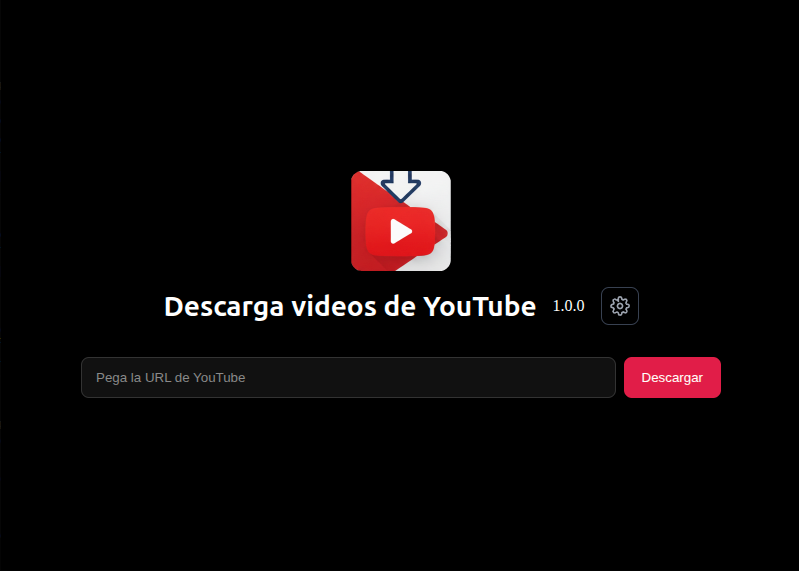
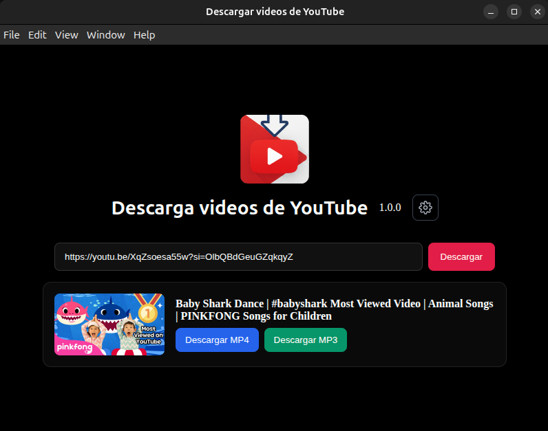
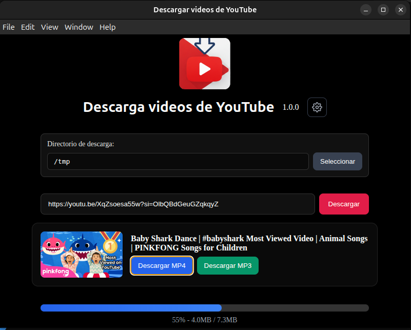
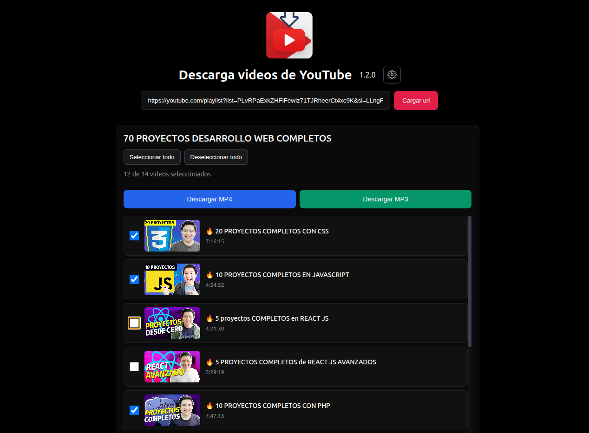

# YouTube Downloader (Electron)

Aplicación de escritorio construida con Electron para descargar videos de YouTube en formatos MP3 (audio) y MP4 (video), con selección de carpeta de descarga y una interfaz simple y moderna.

### Tabla de contenidos
- [Tabla de contenidos](#tabla-de-contenidos)
- [Funcionalidades](#funcionalidades)
- [Tecnologías utilizadas](#tecnologías-utilizadas)
- [Requisitos](#requisitos)
- [Instalación](#instalación)
- [Desarrollo (modo live)](#desarrollo-modo-live)
- [Empaquetado y compilación](#empaquetado-y-compilación)
- [Estructura del proyecto (resumen)](#estructura-del-proyecto-resumen)
- [Configuración de la carpeta de descarga](#configuración-de-la-carpeta-de-descarga)
- [Uso básico](#uso-básico)
- [Capturas de pantalla](#capturas-de-pantalla)
- [Solución de problemas](#solución-de-problemas)
- [Próximos pasos (roadmap)](#próximos-pasos-roadmap)
- [Licencia](#licencia)
- [Autoría](#autoría)

---

### Funcionalidades
- **Descarga de MP3**: extrae el audio de un video y lo guarda en formato MP3.
- **Descarga de MP4**: descarga el video en formato MP4 con la mejor calidad disponible.
- **Selector de carpeta de destino**: configura la carpeta donde se guardarán las descargas.
- **Empaquetado nativo**: genera instaladores para Linux (.deb) y paquetes portables (.zip). Squirrel (Windows) está configurado.

> Nota: El proyecto incluye `yt-dlp` preempaquetado en `bin/` para funcionar offline durante el empaquetado.

---

### Tecnologías utilizadas
- **Electron**: motor de la app de escritorio.
- **Electron Forge**: tooling para empaquetar y distribuir.
- **yt-dlp-wrap**: wrapper para ejecutar `yt-dlp` desde Node.js.
- **HTML / CSS / JavaScript**: interfaz (`index.html`, `index.css`, `renderer.js`, `preload.js`).

---

### Requisitos
- Node.js 18+ (recomendado)
- pnpm 10+ (el `packageManager` del proyecto apunta a pnpm). También puedes usar npm.

---

### Instalación
Usando pnpm (recomendado):
```bash
pnpm install
```

Con npm:
```bash
npm install
```

---

### Desarrollo (modo live)
- Con pnpm:
```bash
pnpm start
```
Esto ejecuta `electron-forge start` con recarga en desarrollo.

- Alternativa ligera (lanza Electron directamente):
```bash
pnpm dev
```

Con npm:
```bash
npm run start
# o
npm run dev
```

---

### Empaquetado y compilación
- Solo empaquetar (carpeta de la app sin instalador):
```bash
pnpm package
```

- Construir instaladores/artefactos (según `forge.config.js`):
```bash
pnpm make
```
Salidas típicas:
- `out/make/deb/x64/*.deb` (instalador para Debian/Ubuntu)
- `out/make/zip/linux/x64/*.zip` (paquete portable)
- Configuración para Squirrel (Windows) incluida; RPM comentado por defecto

Con npm:
```bash
npm run package
npm run make
```

---

### Estructura del proyecto (resumen)
```
bin/                      # binarios yt-dlp incluidos (linux y windows)
icons/                    # iconos de la app
downloads/                # carpeta por defecto de descargas (puede cambiarse desde la app)
index.html | index.css    # UI
index.js                  # proceso principal (main)
preload.js                # bridge seguro hacia el renderer
renderer.js               # lógica de UI y llamadas a yt-dlp
forge.config.js           # configuración de Electron Forge
```

---

### Configuración de la carpeta de descarga
- La aplicación permite elegir la carpeta de descarga desde la propia interfaz (selector de directorio).
- Por defecto, las descargas se guardan en `downloads/`. Puedes cambiarla y tu preferencia quedará aplicada para las siguientes descargas durante la sesión.

---

### Uso básico
1. Abre la app en modo desarrollo o instalada.
2. Pega la URL del video de YouTube.
3. Elige el formato: **MP3** (audio) o **MP4** (video).
4. Selecciona la carpeta de destino si quieres cambiarla.
5. Pulsa **Descargar** y espera a que finalice.

---

### Capturas de pantalla

- **Inicio (launch)**: vista al abrir la aplicación.



- **Video cargado (load)**: muestra los controles disponibles tras cargar un video.



- **Descargando (saving)**: barra de progreso durante la descarga.



- **Listas de reproducción**: Selecciona los vídeos de una lista de reproducción y guárdalos todos a la vez.



---

### Solución de problemas
- Si una descarga falla, verifica:
  - Conexión a internet y disponibilidad del video.
  - Permisos de escritura en la carpeta de destino.
  - Que el binario `yt-dlp` tenga permisos de ejecución en Linux (`chmod +x bin/yt-dlp`).
- En caso de bloqueo por antivirus en Windows (Squirrel), marca el binario como confiable.

---

### Próximos pasos (roadmap)
- **Descarga de canales**: introducir la URL de un canal y listar los videos disponibles.
- **Selección de elementos**: UI para seleccionar qué videos de la playlist/canal descargar.
- **Cola de descargas y reintentos**: gestionar múltiples descargas con progreso individual.
- **Persistencia de preferencias**: recordar carpeta de descargas y formato preferido entre sesiones.

---

### Licencia
MIT. Consulta `package.json`.

### Autoría
- Óscar Hernández
